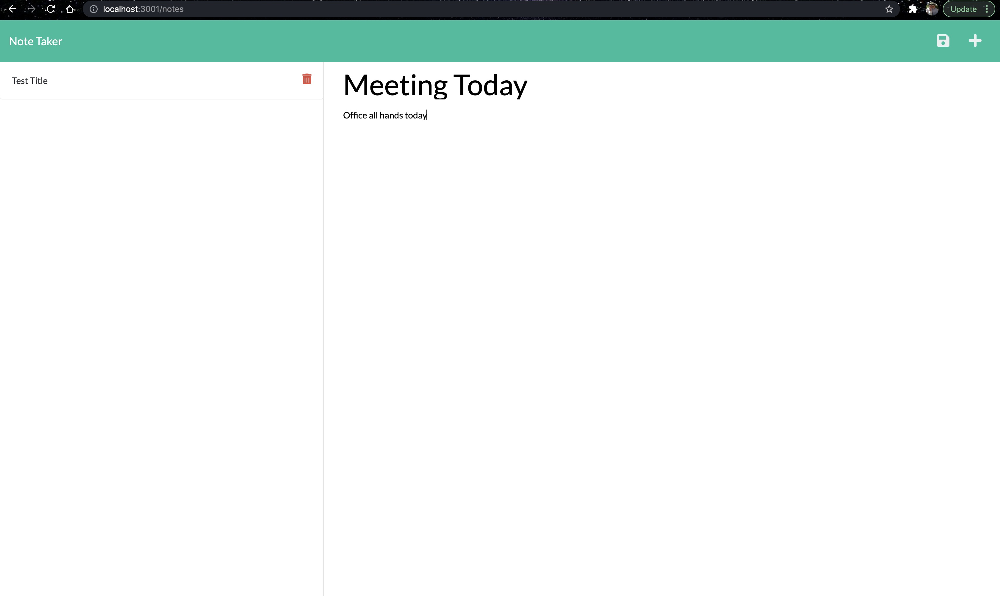

 

  # Title: Note Taker

    
  
  ## Description: This project is a simple note taker and planner. It takes input from the user in the form of a title and description. The user clicks the save button and it saves the notes on the left side of the screen.

  ## Usage:  First the user runs sever.js and is presented with a home page that has a button to click to begin. Then the user clicks on the title and adds a description under neath. When this happens the save button appears, when the user clicks save. It sends the data entered VIA an api call and route to save to a file. The saved data then appears on the left hand of the screen.

  ## Questions: johndesgarennes@gmail.com

  ## Github username: jdesgarennes

  ## License type: MIT

  ## link to heroku:  https://john-note-taker.herokuapp.com/

  ## link to Repo: https://github.com/jdesgarennes/Note-Taker

  

